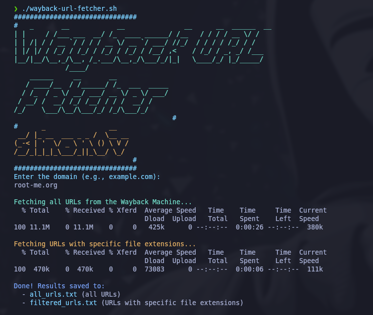

# Wayback URL Fetcher

**Wayback URL Fetcher** is a simple and powerful bash script that helps you fetch all URLs or specific URLs with certain file extensions from the [Wayback Machine](https://web.archive.org). This tool can be useful for scraping historical data or recovering resources from archived websites.

## Features

- Fetch all URLs for a given domain from the Wayback Machine.
- Filter URLs based on specific file extensions such as PDFs, images, documents, and more.
- Save results in two output files:
  - `all_urls.txt`: All archived URLs.
  - `filtered_urls.txt`: URLs that match specific file types.

## Installation

### Clone the repository:

First, clone the repository to your local machine:

```bash
git clone https://github.com/s1mon0v/wayback-url-fetcher.git
cd wayback-url-fetcher
```
### Make the script executable:

Change the permissions of the script to make it executable:

```bash
chmod +x wayback-url-fetcher.sh
```

## Usage

### 1. Running the script:

```bash
./wayback-url-fetcher.sh
```

### 2. Enter the domain name:

```bash
Enter the domain (e.g., example.com): 
```

### 3. View the results:

After the script finishes executing, the results will be saved in two text files:

- **all_urls.txt**: Contains all URLs.
- **filtered_urls.txt**: Contains only the URLs with specific file extensions (such as PDFs, images, etc.).

## Screenshot

Here’s a screenshot of the script in action:

> This is how the script looks when fetching URLs from the Wayback Machine.



## File Extensions Filtered

By default, the script filters URLs that end with the following file extensions:
- `.xls`, `.xml`, `.xlsx`, `.json`, `.pdf`, `.sql`, `.docx`, `.pptx`, `.txt`
- `.zip`, `.tar.gz`, `.7z`, `.rar`, `.bak`, `.log`, `.db`, `.config`, `.csv`, `.yaml`
And more.

You can modify the script to add or remove file extensions based on your needs.

## License

wayback-url-fetcher is licensed under the MIT License. See the [LICENSE](LICENSE) file for details.

## Disclaimer

This tool is intended for educational and testing purposes only. It should not be used for any malicious activities.
